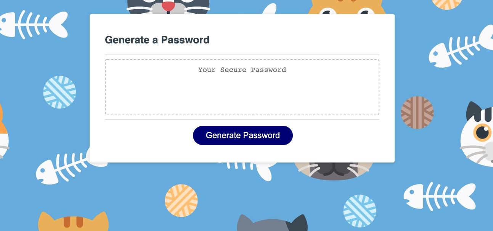
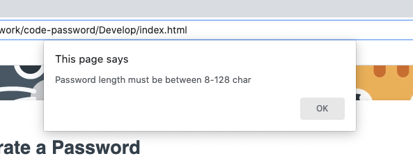
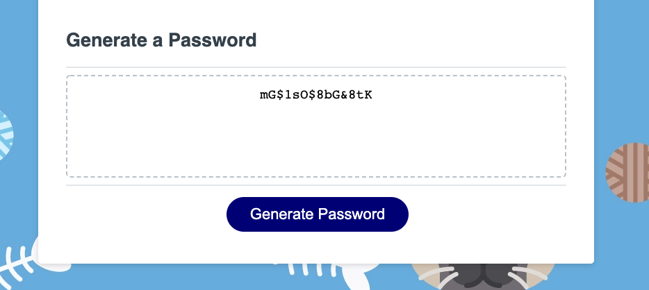

# code-password
Here I have created a password generator that will generate a password between 8-124 characters

Users will be prompted multiple times to indicate what type of password they would like(length, different variables used)

Once all user input is taken, password is generated based off user's selected variables

Thanks for reading! - E